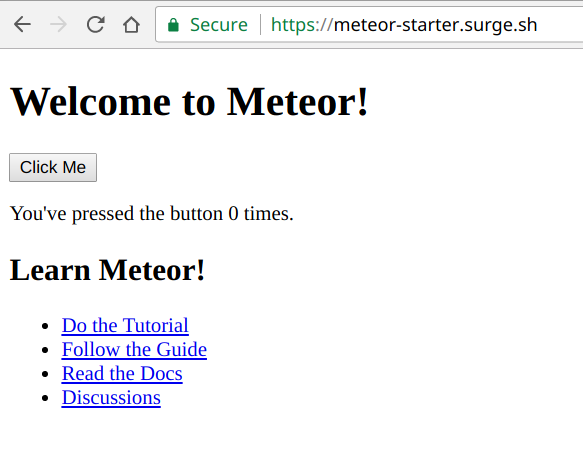

# Meteor Surge Starter
> starter for running a client-only application on [surge](https://surge.sh/)




## Installation

```sh
meteor npm install
```

## Develop

```sh
meteor
```

Go to [localhost:3000](http://localhost:3000/).

## Deploy

```sh
meteor npm run deploy
```

## Meta

Jordan Garside – jordangarside@gmail.com

Distributed under the MIT license. See ``LICENSE`` for more information.

[https://github.com/jordangarside/meteor-surge-starter](https://github.com/jordangarside/meteor-surge-starter)

## Contributing

1. Fork it (<https://github.com/jordangarside/meteor-surge-starter/fork>)
2. Create your feature branch (`git checkout -b feature/fooBar`)
3. Commit your changes (`git commit -am 'Add some fooBar'`)
4. Push to the branch (`git push origin feature/fooBar`)
5. Create a new Pull Request

<!-- Markdown link & img dfn's -->
[npm-image]: https://img.shields.io/npm/v/datadog-metrics.svg?style=flat-square
[npm-url]: https://npmjs.org/package/datadog-metrics
[npm-downloads]: https://img.shields.io/npm/dm/datadog-metrics.svg?style=flat-square
[travis-image]: https://img.shields.io/travis/dbader/node-datadog-metrics/master.svg?style=flat-square
[travis-url]: https://travis-ci.org/dbader/node-datadog-metrics
[wiki]: https://github.com/yourname/yourproject/wiki
